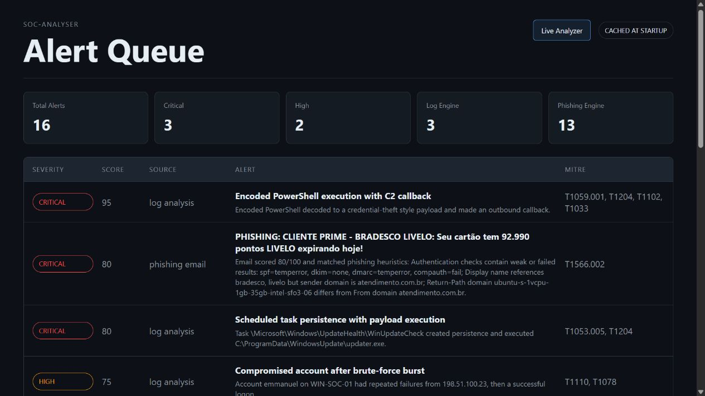

# SOC-Analyser

Mini SOC Analyst Platform -- phishing detection, log analysis, and automated incident response.

## Planned Modules

- `apps/api` - backend API for scans, log ingestion, incidents, and response actions
- `apps/web` - analyst dashboard frontend
- `apps/worker` - background jobs for enrichment, rule runs, and notifications
- `packages/detectors` - phishing and IOC detection logic
- `packages/log-parser` - reusable log parsing utilities
- `packages/playbooks` - automated incident response playbooks
- `data` - local sample logs, rules, and generated reports
- `infra` - Docker and deployment configuration
- `docs` - architecture notes and project documentation

## Phishing Engine Baseline

The phishing engine analyzes `.eml` files and emits the shared `Alert` dataclass
used by the rest of the platform. Each heuristic follows the same shape:

`triggered`, `weight`, `reason`, and optional `indicator`.

This keeps the detector explainable: the final score is useful, but the evidence
trail is what makes the output analyst-ready.

Current heuristic coverage:

- Authentication-Results failure or weak-result detection for SPF, DKIM, DMARC, and compauth
- Display-name brand impersonation versus sending domain
- Return-Path domain mismatch
- Reply-To domain mismatch
- Risky attachment extension detection
- Urgency and social-engineering language in subject/body
- Suspicious link patterns, including raw IP hosts, link volume, and external domain spread
- Free-provider brand impersonation, subject brand mismatch, relay obfuscation, and risky marketplace/crypto lure language

Evaluation dataset:

- 8 real phishing emails from `rf-peixoto/phishing_pot`
- 5 synthetic legitimate emails
- 13 total `.eml` test cases

Measured result:

- Accuracy: 12/13 = 92.3%
- False positives on legitimate samples: 0
- Threshold: 20/100

Known limitation:

- `sample-1000.eml` is a Portuguese-language tax-refund lure sent through a
  genuine, SPF/DKIM/DMARC-passing Gmail account. The current heuristic engine
  intentionally avoids broad language-specific content classification, so this
  remains a documented miss rather than a hand-tuned score.

Run the evaluation:

```bash
python scripts/evaluate_phishing_engine.py
```

## Log Analysis Engine

The log engine uses schema-accurate synthetic Windows Security and Sysmon JSON
events instead of binary `.evtx` parsing. This keeps the project lightweight
while still modeling realistic SOC telemetry.

Scenario covered:

- Brute-force burst against `emmanuel`
- Successful logon from the same source
- Obfuscated PowerShell with decoded Mimikatz-style payload
- Account discovery with `whoami`
- C2 callback
- Scheduled task persistence
- Confirmed payload execution
- Three benign events as noise

Current result:

- 15 raw events
- 3 correlated alerts
- 0 false positives on the benign events

Run the log engine through the test suite:

```bash
python -m unittest discover -s tests
```

## SIEM Dashboard

The Flask dashboard loads phishing and log alerts once at startup, then serves a
stable alert queue and detail pages.



```bash
python apps/dashboard/app.py
```

Then open:

```text
http://127.0.0.1:5001
```

Live email analyzer:

```text
http://127.0.0.1:5001/analyze
```

Use it to paste raw email content or upload a `.eml` file. Results use the same
phishing engine as the sample dataset and are appended to the dashboard queue for
the current app session.

## Incident Reports

Markdown and PDF incident response reports are generated for the showcase log
alerts in `data/reports`.

```bash
python scripts/generate_incident_reports.py
```

